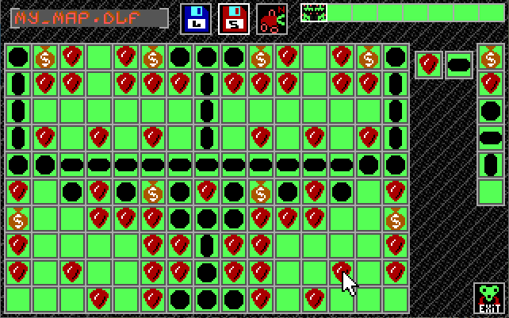

# digger-map-editor

Map Editor for <a href="https://digger.org/download.html">Digger Remastered</a> (re-creation of old game Digger by Windmill Software).



## Build

### Requirements

- Windows host
- [Free Pascal 3.2.2](https://www.freepascal.org/download.html) (i386-win32) with the **i8086-msdos** cross compiler
  (`ppcross8086.exe`, installed by the `fpc-3.2.2.i386-win32.cross.i8086-msdos` package)
- NASM (`nasm.exe`) in the FPC `bin` directory

By default the build script expects the toolchain in `C:\FPC\3.2.2\bin\i386-win32`.
If FPC is installed elsewhere, set the `FPCBIN` environment variable:

```cmd
set FPCBIN=D:\FPC\3.2.2\bin\i386-win32
```

### Building

Run from the project root:

```cmd
build.cmd
```

The script:

1. assembles every `asm\*.asm` file with NASM into an OMF object `asm\*.obj`
   (the objects are linked into the units via `{$L asm/*.obj}`);
2. compiles and links `run_dme.pas` into `run_dme.exe`
   (target `i8086-msdos`, small memory model, options `-Pi8086 -Tmsdos -WmSmall -B`).

All units are always rebuilt (`-B`), because FPC does not track changes of the `.obj` files.

To build another program, pass its source file as an argument:

```cmd
build.cmd my_program.pas
```

### Running

`run_dme.exe` is a 16-bit DOS program, run it in DOSBox or a real/virtual DOS machine.
